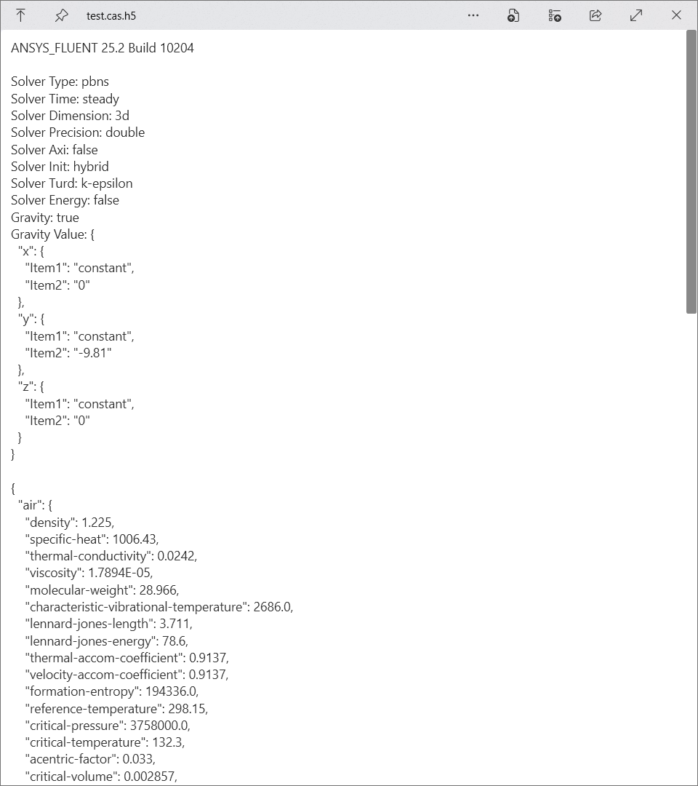
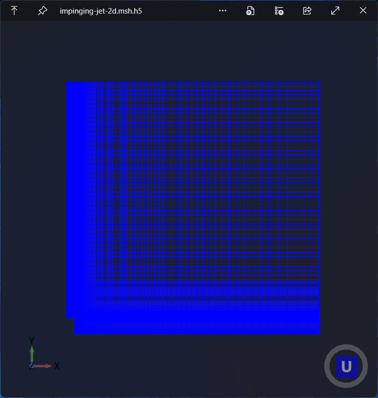
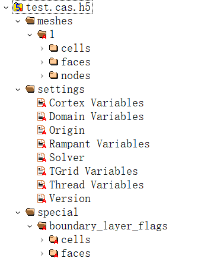

# QuickLook.Plugin.AFH5

A plugin to preview Ansys Fluent cas.h5 and msh.h5 file.

  

## Structure of cas.h5

For an introduction to the H5 format, you can refer to this [article](https://optics.ansys.com/hc/en-us/articles/360034936913-HDF5-files).

For an introduction to the CFF format, you can refer to this [article](https://ansyshelp.ansys.com/public/account/secured?returnurl=/Views/Secured/corp/v252/en/flu_ug/flu_ug_app_cff.html).

After opening `.cas.h5` file using HDFView, there are following groups:

1. meshes
2. settings
3. special

The **settings** group contains multiple datasets, which contain the simulation configuration information stored as S-expression strings which you can find in the **example** folder.

1. Cortex Variables: Face IDs and display settings
2. Domain Variables: Meaning unclear (e.g. (64 ()))
3. Origin: Ansys Fluent build information (e.g. ANSYS_FLUENT 25.2 Build 10204)
4. [Rampant Variables](https://innovationspace.ansys.com/forum/forums/topic/what-does-rp-in-rp-variable-stand-for/): Most settings
5. Solver: Solver information (e.g. ANSYS_FLUENT)
6. TGrid Variables: Geometry mesh related
7. Thread Variables: Cell zone and boundary condition
8. Version: Version information (e.g. 25.2)

## Note

> [!IMPORTANT]
> Only tested with Ansys Fluent 2025 R2.

### cas.h5

This plugin now only show the most frequent information, including:

- solver
- material
- cell zone
- boundary condition
- discretization scheme
- under-relaxation factor
- iteration

They are extracted by regular expression or S-expression parser. PRs are welcome to add more.

### msh.h5

This plugin now don't support multi zone mesh and the display quality of the 3D mesh is poor.

## Try out

1. Go to Release page and download the latest version.
2. Make sure that you have QuickLook running in the background. Go to your Download folder, and press `Spacebar` on the downloaded `.qlplugin` file.
3. Click the “Install” button in the popup window.
4. Restart QuickLook.
5. Select the cas.h5/msh.h5 file and press `Spacebar`.

## Thanks

- [QuickLook](https://github.com/QL-Win/QuickLook): Bring macOS “Quick Look” feature to Windows
- [PureHDF](https://github.com/Apollo3zehn/PureHDF): A pure .NET library that makes reading and writing of HDF5 files (groups, datasets, attributes, ...) very easy.
- [Untitled.Sexp](https://github.com/salyu9/Untitled.Sexp): Simple .Net library for reading, writing and serializing s-expressions.
- [HelixToolkit.Wpf](https://github.com/helix-toolkit/helix-toolkit): Helix Toolkit is a collection of 3D components for .NET.

## License

MIT
