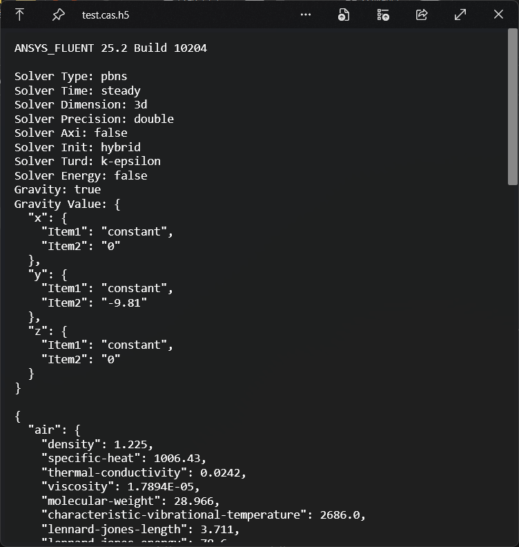

# QuickLook.Plugin.AFH5

A plugin to preview Ansys Fluent cas.h5 file.

## Note
> [!NOTE]
> Only tested with Ansys Fluent 2025 R2.

It now only show the most frequent information, including:
- solver
- material
- cell zone
- boundary
- discretization scheme
- under-relaxation factor
- iteration

PRs are welcome to add more.

## Try out

1. Go to Release page and download the latest version.
2. Make sure that you have QuickLook running in the background. Go to your Download folder, and press `Spacebar` on the downloaded `.qlplugin` file.
3. Click the “Install” button in the popup window.
4. Restart QuickLook.
5. Select the cas.h5 file and press `Spacebar`.

## License

MIT.
